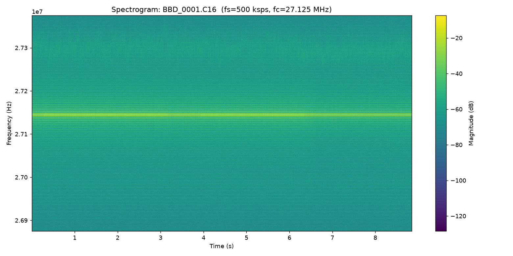
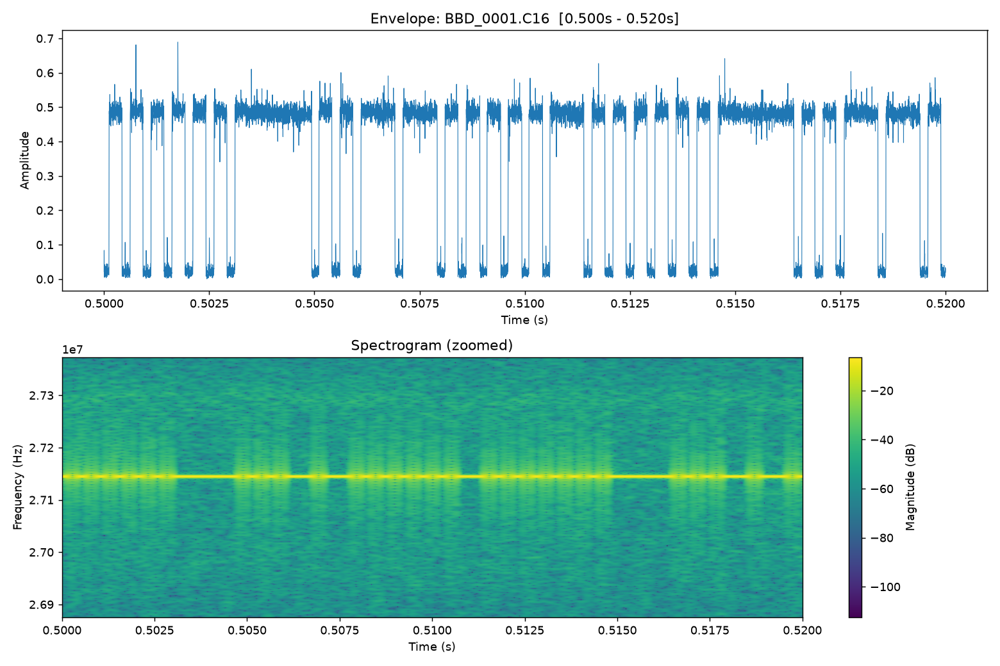

# Rokenbok SDR reverse engineering & replay

Reverse-engineered the RF protocol of the 27MHz remote-control of Rokenbok toys, and built tools to capture, replay, synthesize, and live-drive it with a HackRF or RaspberryPi

## Contents

- [Status](#status)
- [Hardware](#hardware)
- [Protocol](#protocol)
- [Repo layout](#repo-layout)
- [Building](#building)
- [Usage](#usage)

## Status

| Capability | Tool | Verified against the real toy |
|---|---|---|
| Frequency + protocol decode | — | ✅ cross-checked via RTL-SDR, HackRF RX, logic analyzer |
| Raw-capture replay | `replay_hackrf` | ✅ |
| From-scratch signal synthesis | `ook_tx` | ✅ (after fixing a framing bug — see below) |
| Live real-time joystick control | `hotas_drive` | ✅ (after fixing a second framing bug — see below) |
| Same tools, via a Raspberry Pi + rpitx-ui instead of a HackRF | [`rpitx/`](rpitx/) | ⏳ builds and logic tested on the dev PC; the actual RF hop through `sendiq` needs real Pi hardware to verify |

## Hardware

- **HackRF One** — transmits. All three tools talk to it directly via
  `libhackrf`.
- **Thrustmaster T.A320 Pilot HOTAS stick** — live control input for
  `hotas_drive`, read via the Linux joystick API (`/dev/input/js0`).

## Protocol

Real carrier frequency: **27,144,449 Hz**, measured independently two ways
(RTL-SDR and HackRF RX) that agreed to within ~1 Hz. Not 27.125 or
27.145 MHz, as some early exploration assumed.

True OOK (on/off keying), 16-bit word, MSB-first:

```
 HIGH  ┃█████ pause █████┃  ┃██ bit ██┃  ┃████ bit ████┃         ┃█████ pause █████┃
 LOW   ┃                 ┗━━┛         ┗━━┛             ┗━━ ... ━━┛                 ┗━━
        ├─── 1813 µs ────┤ 193 ├ 311/809 ┤ 193 ├  311/809  ┤ 193       (next frame's pause
                                 =bit 0            =bit 1                begins immediately —
                                                                          no gap between frames
                                                                          while a button's held)
```

- A **pause** HIGH pulse (**1813 µs**) marks the start of each frame.
- A fixed LOW gap (**193 µs**) follows *every* pulse, including the pause —
  skip it and the pause fuses with the first bit, corrupting the whole
  frame.
- Then 16 bit-pulses: HIGH width encodes the bit (**311 µs = 0**,
  **809 µs = 1**), each followed by the same 193 µs LOW gap.
- While a button is held, the *next* frame's pause begins immediately after
  the last bit's LOW gap — no extra silence. This detail turned out to
  matter a lot (see [Bugs found & fixed](#bugs-found--fixed)).

Word layout (MSB-first) — see `assets/key_order.jpg` for the original
derivation:

```
 A3 A2 A1 A0  N  S  E  W  A  B  X  Y  ?12 ?13 SL ?15
 └── addr ──┘ └────── one independent bit per button ──────┘  └ unconfirmed ┘
```

- `A3..A0`: 4-bit paired address/remote-ID nibble. Most examples right now hard code address 3 (used in testing)
- `N S E W A B X Y SL`: one bit per button, set independently, so combos
  (e.g. diagonals) are just multiple bits set at once.
- `?12 ?13 ?15`: bits observed in captures whose function is unconfirmed.

<p float="left">
  
  
</p>

*Left: full spectrogram of a captured signal. Right: a 20ms zoom showing the
individual OOK bit-pulses (envelope on top, spectrogram below).*

## Repo layout

**Working tools** (build these — see [Building](#building)):

| File | Purpose |
|---|---|
| `ook_tx.cpp` → `ook_tx` | Synthesizes a 16-bit OOK frame from scratch (no capture needed) and streams it to the HackRF on a loop. `--addr`/`--btn` pick the word, or `--word 0xHEX` for a raw override. `--dry_run` builds and prints without touching hardware. |
| `replay_hackrf.cpp` → `replay_hackrf` | Replays a raw `.C16` capture (+ matching `.TXT` metadata for center freq / sample rate) directly out the HackRF, looping. |
| `hotas_drive.cpp` → `hotas_drive` | Live control: reads a HOTAS joystick and continuously synthesizes/streams whatever word the stick currently represents, address 3. `--dry-run` prints word changes without transmitting. |
| `c16_to_i8_shift.py` | Utility: converts a `.C16` (int16 I/Q) capture to interleaved int8 I/Q, e.g. for `hackrf_transfer`. |
| [`rpitx/`](rpitx/) | Same three tools, ported to transmit via a Raspberry Pi + [rpitx-ui](https://github.com/IgrikXD/rpitx-ui)'s `sendiq` instead of a HackRF — see its own README. |

**Reference data:**

| File | Purpose |
|---|---|
| `assets/key_order.jpg`, `assets/timing.png` | Original protocol-derivation references (bit layout, pulse timing). |
| `assets/spectrogram_full.png`, `assets/spectrogram_zoom.png` | Example spectrograms of a capture. |

## Building

Needs `libhackrf` dev headers (`pkg-config libhackrf`):

```sh
g++ -O2 -o ook_tx ook_tx.cpp $(pkg-config --cflags --libs libhackrf) -lpthread
g++ -O2 -o replay_hackrf replay_hackrf.cpp $(pkg-config --cflags --libs libhackrf) -lpthread
g++ -O2 -o hotas_drive hotas_drive.cpp $(pkg-config --cflags --libs libhackrf) -lpthread
```

## Usage

**Synthesize and send a single command** (address 3, button A, 3 seconds):

```sh
timeout 3 ./ook_tx --addr 3 --btn A --fif 19449 --vga 30 --amp_on 1
```

`--btn` takes comma/plus-separated names (`N S E W A B X Y SL`); `--fif
19449` targets the precisely-measured real carrier (27,144,449 Hz) rather
than the tool's slightly-off built-in default. `--list-buttons` prints
valid names.

**Live-drive with the HOTAS stick:**

```sh
./hotas_drive             # Ctrl+C to stop
./hotas_drive --dry-run   # print word changes only, no HackRF
```

Axis 0 (roll) → E/W, axis 1 (pitch) → N/S, buttons 0–3 → A/B/X/Y. Add
`--invert-y` if forward/back feels backwards, `--addr N` for a different
paired address.